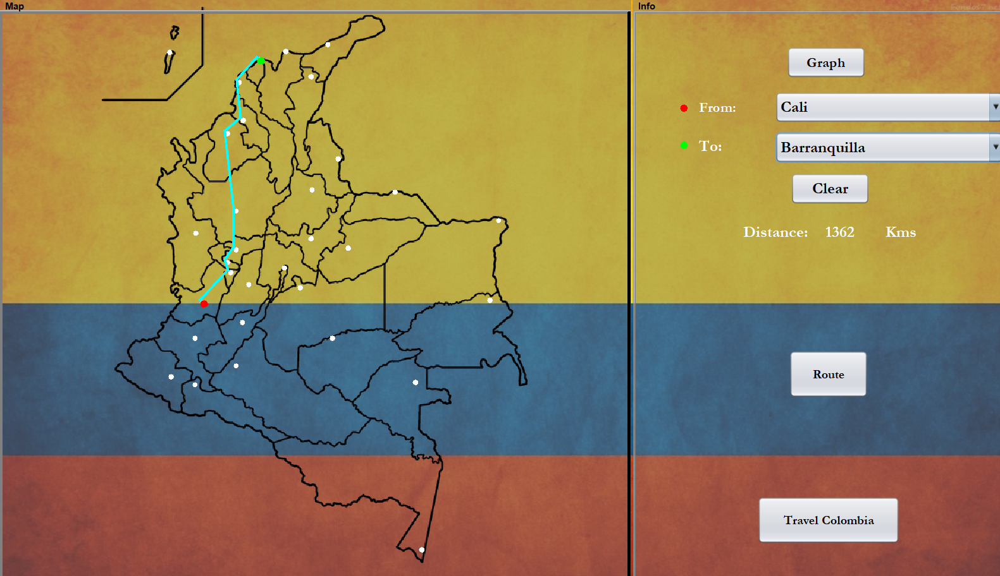
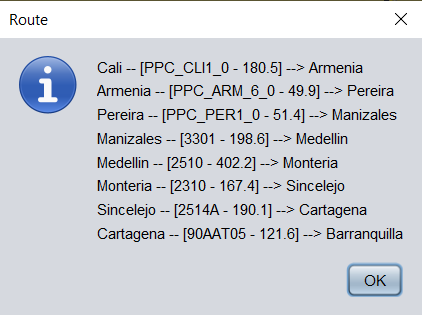
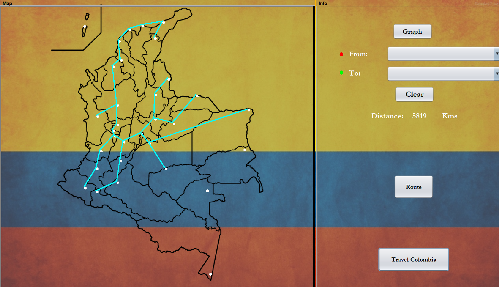

# Shortest Path Colombia Cities

This project is an desktop application that shows the shortest path between cities of Colombia through the main routes. Also shows the shortest path to travel all cities. 

The above functions were implemented using a **graph**.

To compute the shortest path between any city to another were used the **Dijkstra Algorithm**.

To compute the shortest path to travel all cities were used the **Kruskal Algorithm**.

- Shortest Path between Cali and Barranquilla.

The route:

- Minimum Spanning Tree.

Authors:
- Juan Camilo Vélez Olaya
- Daniel Alejandro Cerquera Castro
- Juan David Paz Dorado

For further information, all can be found here [documents](https://github.com/juanchovelezpro/ShortestPath-ColombiaCities/tree/master/DataStructuresProject/documents "documents") and Javadoc can be found here [Javadoc](https://github.com/juanchovelezpro/ShortestPath-ColombiaCities/tree/master/DataStructuresProject/docs "Javadoc").
